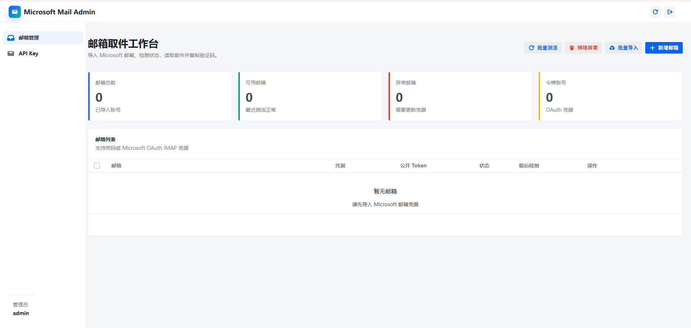
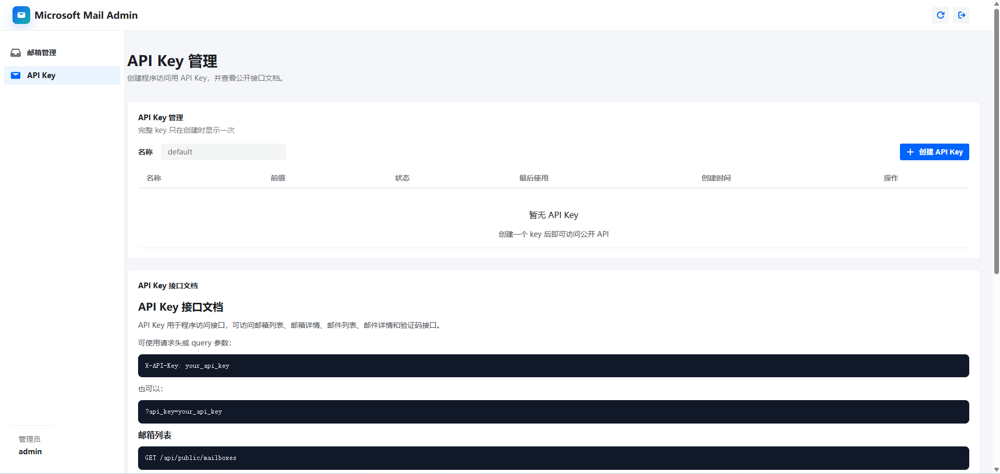
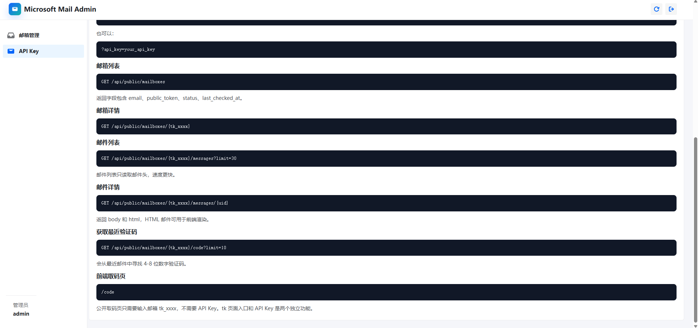

# Microsoft 邮件取件系统

FastAPI + SQLite + React + Semi Design。Docker 部署时由 Python/FastAPI 同时提供 API 和前端静态页面，不使用 Nginx。

## 功能

- 管理员 JWT 登录
- 邮箱批量导入：`邮箱----密码----client_id----令牌`
- 导入前测活、多选批量测活、一键移除异常邮箱
- 获取邮件列表、邮件详情、HTML 邮件渲染、验证码复制
- 每个邮箱自动生成 `tk_xxxx` 公开取码 token
- 后台创建和管理 `ak_xxxx` API Key
- API Key 接口文档在后台 `/admin/api-keys` 页面渲染
- 公开取码页 `/code`：只输入 `tk_xxxx` 获取验证码
- IMAP 配置列表：维护 iCloud 转发接码用的接收邮箱
- iCloud 邮箱列表：导入时选择 IMAP 配置，支持默认 5 个 `+alias` 分裂导出
- 第三方 iCloud：导入 `邮箱----icloudapi.xyz 取码链接`，支持实时取码和默认 5 个 `+alias` 分裂导出

## 截图







## Docker 部署

1. 复制环境变量模板到根目录：

```bash
cp .env.example .env
```

2. 修改 `.env`，至少替换：

```env
APP_SECRET=replace-with-a-long-random-secret
ADMIN_PASSWORD=change-this-password
PUBLIC_API_KEY=replace-with-a-public-api-key
```

3. 构建并启动：

```bash
docker compose up -d --build
```

4. 打开：

```text
http://localhost:8000
```

默认管理员来自根目录 `.env`：

```text
ADMIN_USERNAME / ADMIN_PASSWORD
```

SQLite 数据会挂载在根目录：

```text
./data/app.db
```

## Docker 常用命令

```bash
docker compose logs -f
docker compose restart
docker compose down
```

## 本地开发

根目录也使用同一份 `.env`：

```powershell
copy .env.example .env
```

后端：

```powershell
cd backend
python -m venv .venv
.\.venv\Scripts\Activate.ps1
pip install -r requirements.txt
uvicorn app.main:app --reload --host 0.0.0.0 --port 8000
```

前端：

```powershell
cd frontend
npm install
npm run dev
```

本地开发打开：

```text
http://localhost:5173
```

## 路由

```text
/login              管理员登录
/admin/mailboxes    邮箱管理
/admin/icloud-mailboxes iCloud 转发邮箱
/admin/third-party-icloud 第三方 iCloud 取码
/admin/imap-configs IMAP 接码配置
/admin/api-keys     API Key 管理和接口文档
/code               公开 tk_xxxx 取码页
```

## Microsoft 邮箱凭据

优先使用 OAuth：

```text
user@outlook.com----可留空----Azure应用client_id----refresh_token或access_token
```

如果租户仍允许 IMAP 密码登录，也可以：

```text
user@outlook.com----邮箱密码----可留空----可留空
```

本系统只应用于你拥有或已获授权管理的邮箱。

## iCloud 转发接码

1. 在 `/admin/imap-configs` 新增 IMAP 接收箱配置。
2. 在 `/admin/icloud-mailboxes` 导入 iCloud 邮箱，导入时选择接收它们转发邮件的 IMAP 配置。
3. 公开接口继续使用按邮箱取码：

```text
GET /api/public/mailboxes/by-email/code?email=user%40icloud.com&limit=10
```

分裂邮箱也会自动回源，例如 `user+abcd@icloud.com` 会匹配 `user@icloud.com`。
第三方 iCloud 邮箱同样使用该 API Key 接口取码，并支持分裂邮箱回源。

系统会在后台每 2 秒检查一次绑定 IMAP 收件箱的新 UID。首次启动回填最近 200 封邮件，之后只批量读取新邮件；
iCloud 邮件和验证码临时保存在 SQLite 中 7 天，公开取码接口不会实时扫描 IMAP。该机制优化的是取件耗时，
不包含 iCloud 向接收邮箱转发邮件本身的传输时间。
